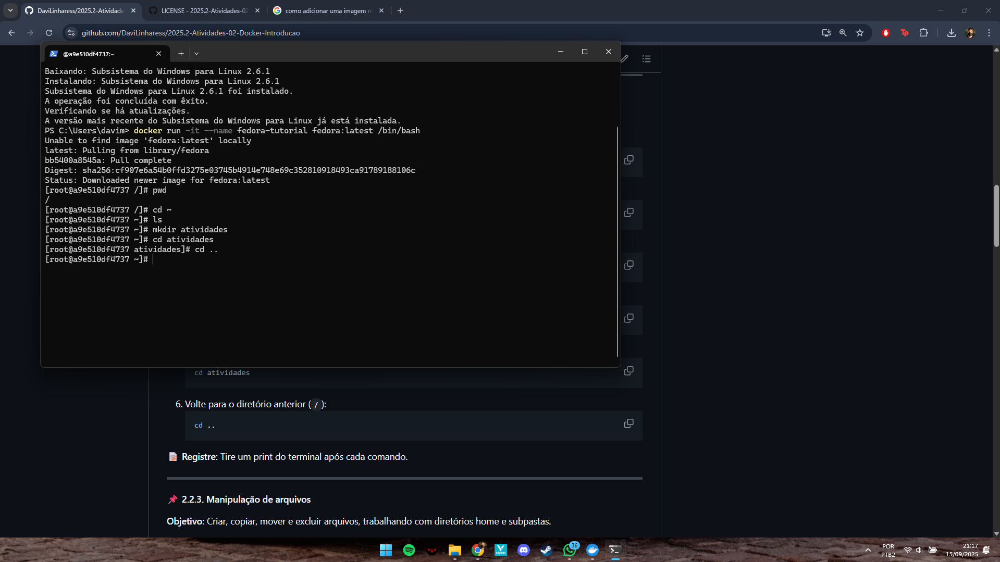
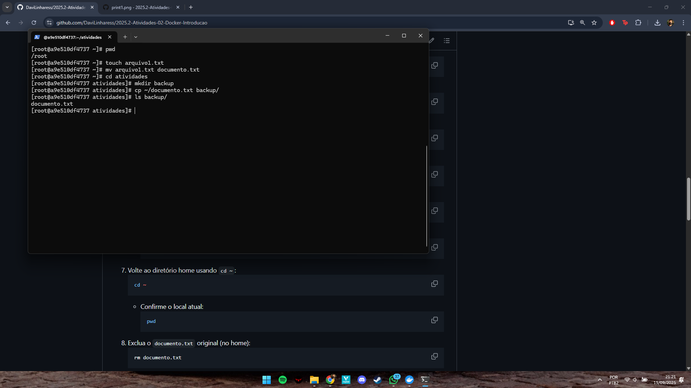
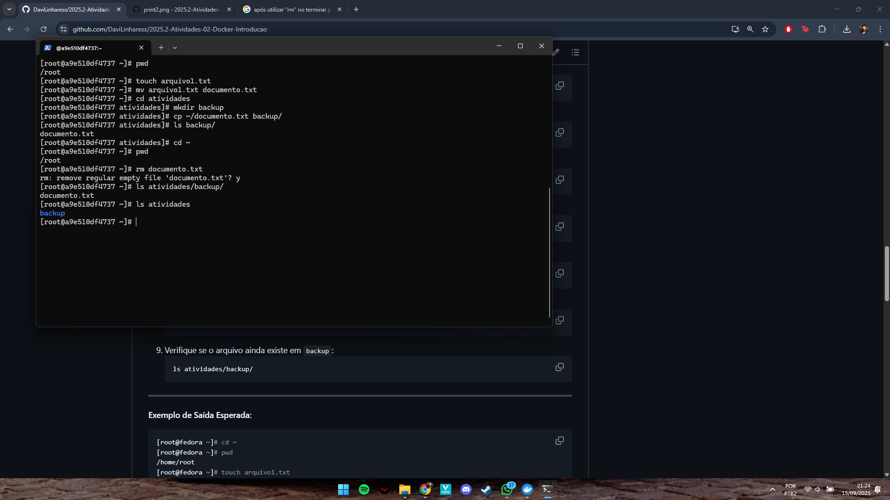
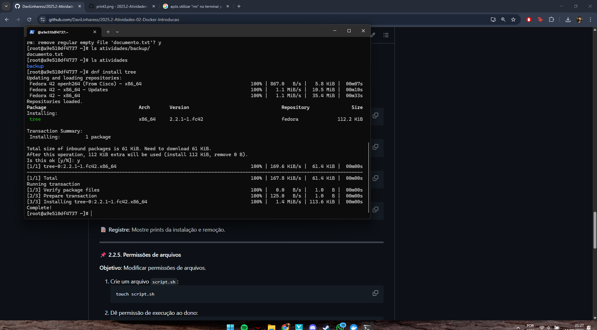
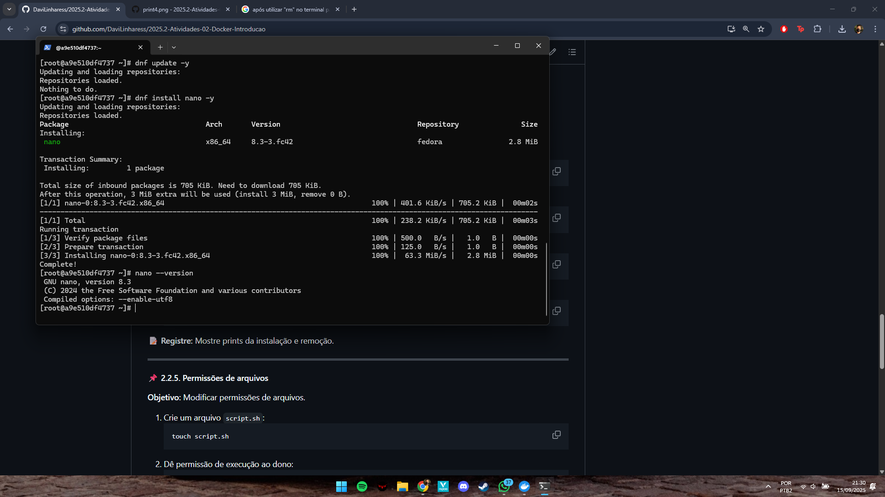
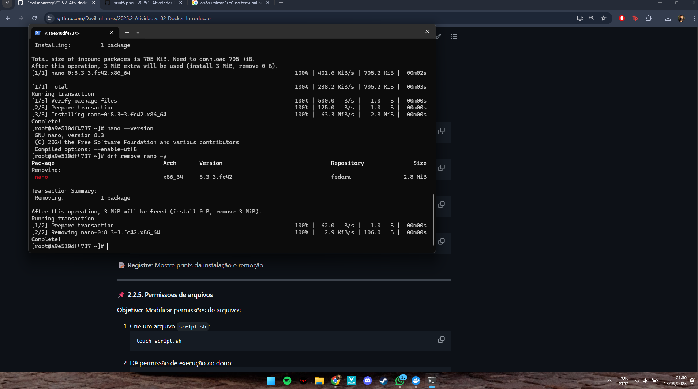
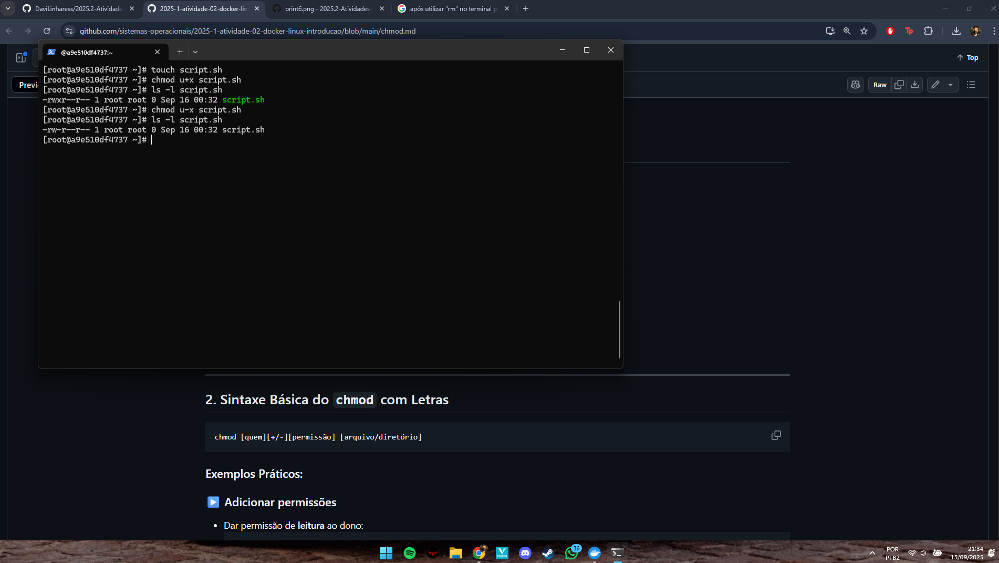
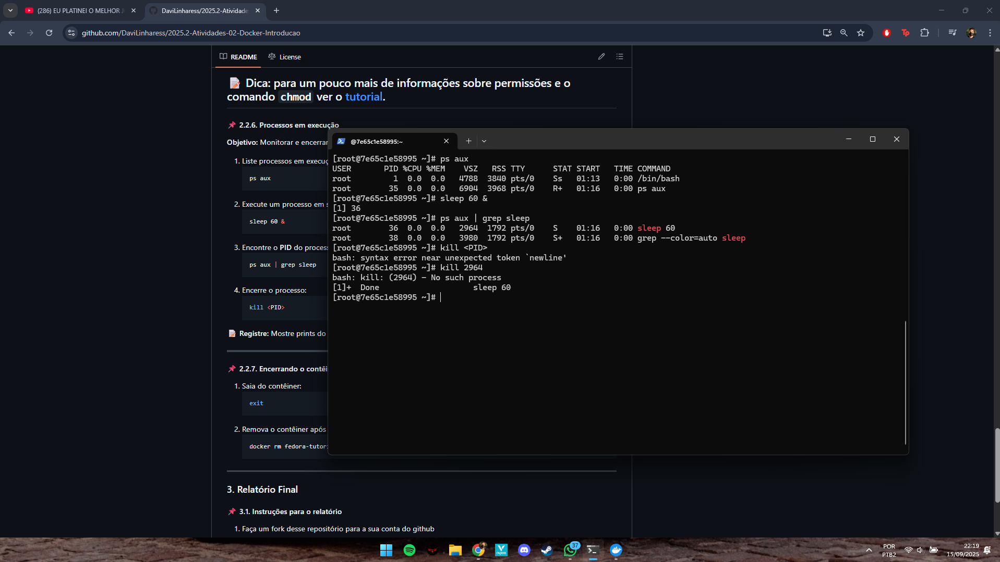
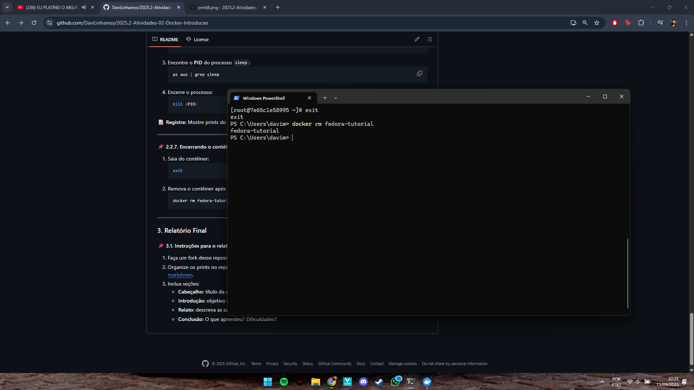

# S.O. 2025.2 - Atividade 01 - Introdução a linux usando docker no windows
## Aluno: Davi de Medeiros Linhares
## Docente: Leonardo A. Minora
## Data: 16 de Setembro de 2025

## Objetivo do Exercício:

### O objetivo desta atividade é realizar uma introdução ao sistema operacional Linux, utilizando o contêiner Docker (Fedora) no ambiente Windows. Através da execução de comandos básicos de navegação, modificação de arquivos, mexer com permissões e controle de processos, desenvolvi uma maior familiaridade com o terminal Linux em um ambiente seguro.

## Desenvolvimento do Exercício:

### Na primeira imagem realizei as atividades 2.2.2. referentes a Navegação Básica, em que aprendi a verificar em qual diretório estou (através do pwd), acessei o diretório home (através do cd ~), listei arquivos do diretório atual (ls), criei uma pasta (mkdir) chamada "atividades", entrei na pasta e depois retornei para o diretorio anterior.

### Após a conclusão da atividade 2.2.2., iniciei a 2.2.3: Manipulação de Arquivos. Nela, aprendi a criar um arquivo (touch arquivo1.txt) e renomear o mesmo (atraves do "mv") para "documento.txt". Após isso, acessei a pasta criada na atividade anterior (atividades) e criei dentro dela um subdiretório chamado "backup" (mkdir backup). Ademais, copiei o arquivo em que eu tinha renomeado para o subdiretório "backup" (através do "cp ~/documento.txt backup/") e por fim, verifiquei se realmente tinha funcionado.

### Continuando a atividade 2.2.3, após copiar o arquivo pra backup, retornei pro diretorio home e verifiquei se realmente estava lá. Depois, solicitei a exclusão do "documento.txt" direto do diretorio home (rm documento.txt). Depois disso, apertei "y" pra confirmar a exclusão; Porém ao confirmar através do ls se o arquivo ainda existia, percebi que não havia sido excluído.

### Para começar a atividade 2.2.4, precisei utilizar o tree para vizualizar a estrutura das pastas (dnf install tree).

### Com o tree instalado, comecei a realizar a etapa 1, 2 e 3 da atividade, que foi atualizar a lista de pacotes (dnf update -y, instalar o editor de texto "nano" (dnf install nano -y) e verificar se o nano foi realmente instalado.

### Após instalar, segui a etapa 4 da atividade, que era remover o editor de texto "nano" (dnf remove nano -y), encerrando a atividade 2.2.4:

### Com isso, comecei a atividade 2.2.5 que tinha como objetivo modificar permissões de arquivos. Comecei criando um arquivo (touch script.sh), depois dei a permissão de execução ao dono (chmod u+x script.sh) e por fim verifiquei as permissões (ls -l script.sh). Porém, eu havia esquecido de registrar com o print o "antes da permissão", então fui ler o tutorial do chmod e aprendi a remover a permissão de execução ao dono (chmod u-x script.sh). Com isso, fiz novamente a verificação da permissão e pude perceber a diferença de coloração na palavra "script.sh":

### Para começar a atividade 2.2.6, precisei baixar o "ps" através do dnf install ps (demorei um pouco para descobrir que precisava baixar). Após baixado, listei os processos em execução (ps aux) e depois executei um processo em segundo plano (sleep 60 &). Com isso, precisava descobrir oque era PID e encontrar o PID do "sleep" através do comando "ps aux | grep sleep". Após isso, precisava encerrar o processo utilizando o kill <PID>; Porém, digitei direto o comando "kill <PID>" e não funcionou... após pesquisar, descobri que o PID estava na informação acima. Após isso, consegui encerrar o processo.

### Por fim, cheguei na ultima atividade, a 2.2.7. Ela seria apenas para encerrar o conteiner, que foi bem tranquilo:

## Conclusão:

### Após realizar todas as atividades, puder ter uma noção básica de como funciona o docker/Linux. Como maiores dificuldades, deixo registrado como confirmar a exclusão do "documento.txt" na atividade 2.2.3, em que não consegui excluir. Além disso, também para descobrir que precisava baixar o "ps" e também descobrir oque era o "PID" na atividade 2.2.6.